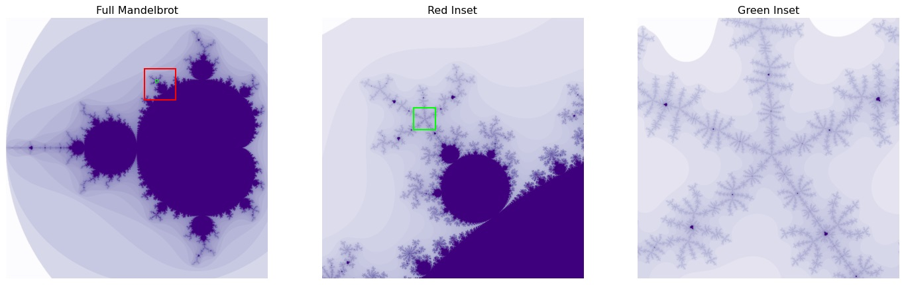

# mandelviews
Compute and visualize the Mandelbrot set.

To install: `pip install mandelviews` 

For details on getting started, please see [the documentation](http://mandelviews.readthedocs.io/).

